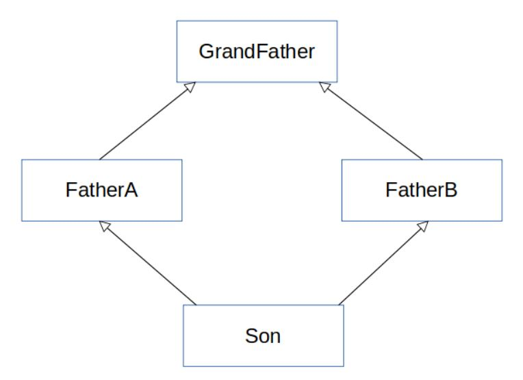

# **Java가 다중상속을 지원하지 않는 이유**

이는 Java 개념정리를 다시 하던 중 C++과는 다르게 Java는 다중상속을 지원 하지 않는 이유에 대해서 궁금해졌기 때문에 조사하였다. 특히 상속은 다중 상속을 막아두었지만 interface를 통하여 다중 상속의 효과는 사용할 수 있도록 한 것이 이해가 되지 않았다.

## **다이아몬드 문제**

다중 상속이 가능한 경우 하나의 클래스가 여러 상위 클래스를 상속 받을 수 있다. 이러한 특징 때문에 발생하는 문제가 다이아몬드 문제이다. 다이아몬드 문제의 이름은 아래와 같이 문제의 발생 모양이 다이아몬드의 형태를 띄어서 붙여진 것 같다.



위의 상황은 코드로 나타내면 상위 클래스 A,B 중 어떤 메서드를 실행해야 할지 몰라  다음과 같은 충돌이 생기게 된다.

```
class GrandClass{
    void func(){
        System.out.println("Grand");
    }
}

class FatherAClass extends GrandClass{
    @Override
    void func(){
        System.out.println("FatherA");
    }
}

class FatherBClass extends GrandClass{
    @Override
    void func(){
        System.out.println("FatherB");
    }
}

class SonClass extends FatherAClass, FatherBClass{
    @Override
    void func(){
        super.func(); // FatherA 와 B 중 어떤 것을 출력해야할 지 모름
    }
}
```

## **인터페이스 다중 상속**

인터페이스는 위와 똑같은 상황이 생길 수 있음에도 다중 상속을 지원한다. 그 이유는 인터페이스는 기능에 대한 선언만 해두기 때문에, 다이아몬드 상속이 발생해도 문제가 발생하지 않는다.

```
interface GrandInterface{
    void func();
}

interface FatherAInterface extends GrandFather {
    @Override
    void func();
}

interface FatherBInterface extends GrandFather {
    @Override
    void func();
}

interface SonInterface extends FatherAInterface, FatherBInterface {
    @Override
    void func(); // 상위 인터페이스에서 구현된 것이 없기 때문에 충돌이 발생하지 않는다.
}
```

## **자바8 이상의 default method**

자바8에서는 default method가 추가되어 내부적으로 interface 구현이 가능하다. 이런 경우는 class처럼 다중 상속을 받을 수 없게 된다.

```
interface GrandInterface{
    default void func(){
        System.out.println("Grand");
    }
}

interface FatherAInterface extends GrandFather {
    @Override
    default void func(){
        System.out.println("Father A");
    }
}

interface FatherBInterface extends GrandFather {
    @Override
    default void func(){
        System.out.println("Father B");
    }
}

interface SonInterface extends FatherAInterface, FatherBInterface {
    컴파일 에러 발생
}
```